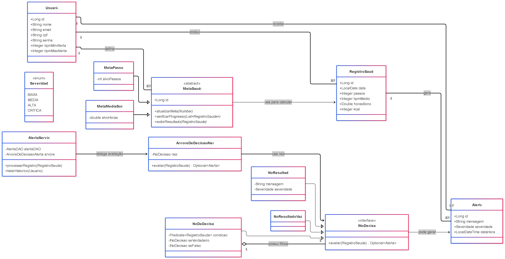

# 📌 Sistema de Análise de Dados de Saúde Pessoal

**Java • POO • JPA (Hibernate) • MariaDB • Arquitetura em Camadas • Árvore de Decisão POO**

---

## 1. Visão Geral

O **Sistema de Análise de Dados de Saúde Pessoal** é uma aplicação Java em modo console que permite o acompanhamento de métricas diárias de saúde, definição de metas personalizadas e geração automática de alertas com base em regras de negócio modeladas por meio de uma **Árvore de Decisão orientada a objetos**.

O sistema foi desenvolvido com foco em boas práticas de **Programação Orientada a Objetos** e **arquitetura em camadas**, evitando lógica acoplada e estruturas condicionais extensas, como `if/else` em cascata.

### Funcionalidades principais

- Cadastro e autenticação de usuários  
- Registro diário de dados de saúde  
- Controle de metas individuais (passos e sono)  
- Geração automática de alertas  
- Avaliação de metas baseada em registros reais  
- Persistência dos dados com JPA/Hibernate e MariaDB  

---

## 2. Tecnologias Utilizadas

- Java 8+  
- JPA (Hibernate)  
- MariaDB  
- Maven  
- Arquitetura MVC + Service + DAO  
- Programação Orientada a Objetos  
- Árvore de Decisão POO (Composite Pattern)  

---

## 3. Diagrama de Classes



## 4. Estrutura do Projeto

A organização do projeto segue o padrão em camadas, promovendo separação de responsabilidades e maior facilidade de manutenção.

```text
src/main/java/
├── view/
│   └── MainConsole.java
│
├── control/
│   ├── UsuarioControl.java
│   ├── RegistroSaudeControl.java
│   ├── MetaSaudeControl.java
│   └── AlertaControl.java
│
├── service/
│   ├── UsuarioService.java
│   ├── RegistroSaudeService.java
│   ├── MetaSaudeService.java
│   └── AlertaService.java
│
├── dao/
│   ├── GenericDAO.java
│   ├── UsuarioDAO.java
│   ├── RegistroSaudeDAO.java
│   ├── MetaSaudeDAO.java
│   └── AlertaDAO.java
│
├── domain/
│   ├── Usuario.java
│   ├── RegistroSaude.java
│   ├── MetaSaude.java
│   ├── MetaPassos.java
│   ├── MetaMediaSono.java
│   ├── Alerta.java
│   ├── Severidade.java
│   └── arvore/
│       ├── INoDecisao.java
│       ├── NoDeDecisao.java
│       ├── NoResultado.java
│       └── NoResultadoVazio.jav

```

---

## 5. Arquitetura do Sistema

O sistema segue uma **arquitetura em camadas**, garantindo separação de responsabilidades:

| Camada   | Responsabilidade |
|--------|------------------|
| view   | Interface com o usuário (console) |
| control | Orquestra chamadas entre view e service |
| service | Contém regras de negócio e validações |
| dao     | Persistência de dados via JPA |
| domain  | Modelo do domínio e regras OO |

Essa abordagem torna o sistema **modular, coeso e de fácil manutenção**.

---

## 6. Requisitos Funcionais

- Cadastrar usuários com validação de CPF e e-mail  
- Autenticar usuários (login)  
- Registrar métricas diárias de saúde:
  - Passos  
  - BPM médio  
  - Horas de sono  
  - Calorias  
- Impedir registros duplicados na mesma data  
- Criar metas de saúde:
  - Meta de passos  
  - Meta de média de sono  
- Permitir apenas uma meta por tipo para cada usuário  
- Atualizar e remover metas  
- Avaliar metas com base nos registros  
- Gerar alertas automáticos  
- Listar registros e alertas por período  

---

## 7. Modelo de Domínio

### Entidades JPA

#### Usuario
- id  
- nome  
- email  
- cpf  
- senha  
- bpmMinAlerta  
- bpmMaxAlerta  

#### RegistroSaude
- id  
- data  
- passos  
- bpmMedio  
- horasSono  
- kcal  
- usuario  

#### MetaSaude (classe abstrata)
- MetaPassos  
- MetaMediaSono  

Utiliza **Herança com JPA** para permitir comportamentos polimórficos na avaliação de metas.

#### Alerta
- id  
- mensagem  
- severidade  
- dataHora  
- usuario  
- registroRelacionado  

---

## 8. Padrões de Projeto Aplicados

### 8.1 Herança e Polimorfismo — Metas de Saúde

MetaSaude (abstract)
├── MetaPassos
└── MetaMediaSono

As metas compartilham comportamentos comuns, mas implementam regras específicas de avaliação de progresso, demonstrando **polimorfismo real**.

---

### 8.2 Composite Pattern — Árvore de Decisão

A geração de alertas utiliza uma **Árvore de Decisão orientada a objetos**, evitando estruturas condicionais rígidas.

| Classe            | Função |
|------------------|--------|
| INoDecisao        | Interface comum para todos os nós |
| NoDeDecisao       | Nó intermediário com condição |
| NoResultado       | Nó folha que gera alerta |
| NoResultadoVazio  | Nó folha sem alerta |

Essa estrutura torna o sistema:

- Extensível  
- Testável  
- Livre de `if/else` extensos  

---

## 9. Banco de Dados

- **Banco:** MariaDB  
- **Persistência:** JPA / Hibernate  
- **Gerenciamento:** via `persistence.xml`  
- **Criação automática de tabelas:** Hibernate  

### Exemplo de criação do banco

```sql
CREATE DATABASE projeto_saude;
```
Configure usuário, senha e URL no persistence.xml.

## 10. Execução do Projeto

1. Clone o repositório
2. Configure o banco MariaDB
3. Execute o build:
mvn clean install
4. Execute a aplicação:
Classe principal:
view.MainConsole

## 11. Considerações Finais

Este projeto demonstra:
- Aplicação correta de POO
- Arquitetura em camadas bem definida
- Uso de JPA com banco relacional real
- Implementação de Árvore de Decisão orientada a objetos
- Código limpo, coeso e fácil de evoluir

O sistema atende plenamente aos objetivos da disciplina e fornece uma base sólida para extensões futuras, como interface gráfica ou serviços web.
